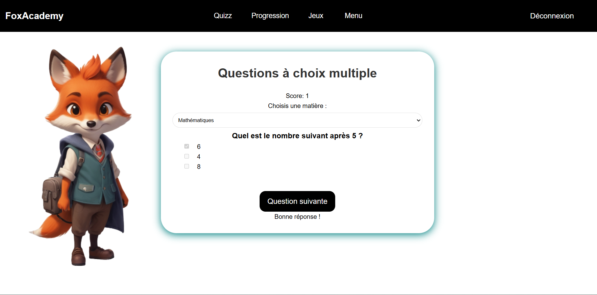
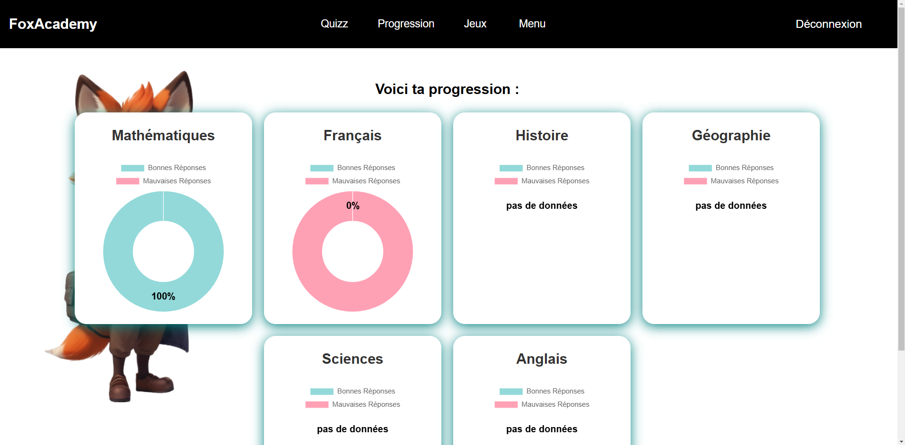
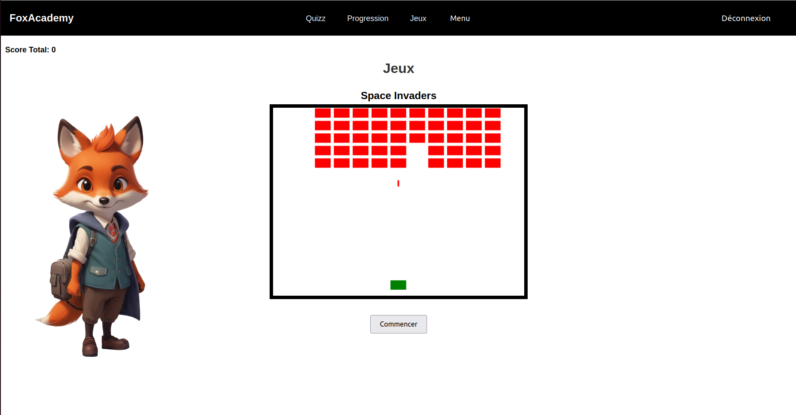

# FoxAcademy

FoxAcademy is an interactive educational platform designed to make learning fun and engaging for children.

## Introduction

Welcome to FoxAcademy! You can access the deployed version of the application [here](coming_soon).

For more details about the project, you can read the final blog article [here](https://medium.com/@hannon.delphine/our-portfolio-project-foxacademy-185f908217b7).

### Authors

- [Stephanie CARVALHO](https://www.linkedin.com/in/stefani-web/)
- [Delphine HANNON](https://www.linkedin.com/profile/in/delphine-hannon-28aa37267/)

## Installation

To install and run this project locally, follow the steps below:

### Backend

1. Clone the repository:
    ```sh
    git clone https://github.com/Delphine-H/Foxacademy.git
    cd Foxacademy/backend
    ```

2. Install dependencies:
    ```sh
    npm install
    ```

3. Configure environment variables by creating a `.env` file based on the `.env.example` file.

4. Configure the backend by modifying the `config.json.example` file:
    ```sh
    cp backend/config/config.json.example backend/config/config.json
    ```
    Open `backend/config/config.json` and update the necessary fields with your configuration details.

### Frontend

1. Navigate to the frontend directory:
    ```sh
    cd ../frontend
    ```

2. Install dependencies:
    ```sh
    npm install
    ```

### Docker Compose

To run the project using Docker Compose, follow these steps:

1. Ensure you have Docker and Docker Compose installed on your machine.

2. Navigate to the root directory of the project:
    ```sh
    cd path/to/your/project/Foxacademy
    ```

3. Build and start the containers:
    ```sh
    docker-compose up --build
    ```

## Usage

Once the application is running, you can access it via [http://localhost:3000](http://localhost:3000) for the frontend and [http://localhost:5000](http://localhost:5000) for the backend.

### Features

- User authentication
- Profile management
- Integrated Space Invaders game
- Question and answer management

## Contributing

Contributions are welcome! To contribute:

1. Fork the project
2. Create your feature branch (`git checkout -b feature/AmazingFeature`)
3. Commit your changes (`git commit -m 'Add some AmazingFeature'`)
4. Push to the branch (`git push origin feature/AmazingFeature`)
5. Open a Pull Request

## Related Projects

- [Landing page](https://github.com/Stefani-web/Landing-page_foxacademy)

## Licensing

This project is licensed under the MIT License. See the [LICENSE](LICENSE) file for details.

## Screenshot





